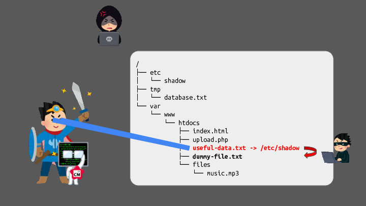
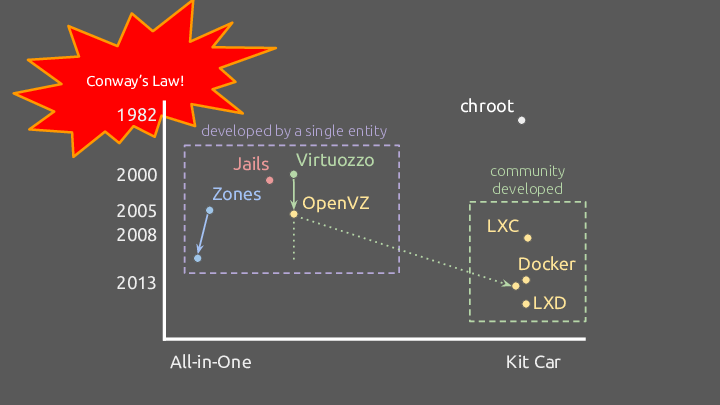
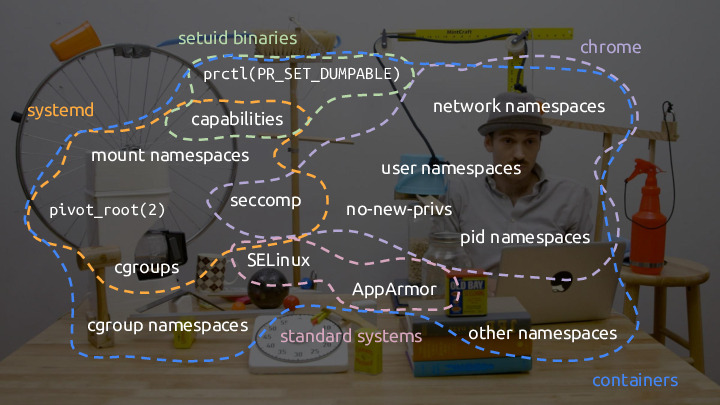

## containers / security / a fun time ##

In contrast to the talk, I'm going to start with the [libpathrs][]-related
take-aways first since it is more applicable to most people and (due to time
constraints) I couldn't go into a lot of detail in the talk.

[libpathrs]: https://github.com/openSUSE/libpathrs

### tl;dr ###

This document got quite long while I was editing it, arguably making it less
useful as a "short resource". So here is a very short tl;dr of the key points:

 * If you have to deal with untrusted paths, make sure you remember that
   symlinks exist and any user can create them. Use `libpathrs` if you can.

 * Because Linux containers are a Rube Goldberg machine of different kernel
   features, the container runtime is a pretty juicy target for attacks, and so
   we need to do a lot of awful things to protect against attacks.

 * However, these kinds of problems apply to a lot of Unix programs and many
   programs don't handle them correctly.

### [libpathrs][] ###

The core problem that [libpathrs][] is trying to solve is that lots of
administrative programs have to operate on an untrusted root directory where an
attacker can modify the filesystem while you're doing administrative operations
on it, which can (and has) lead to various attacks (such as [CVE-2018-15664][],
[CVE-2019-16884][], [CVE-2019-19921][], [CVE-2021-30465][], [CVE-2024-1753][],
and most recently [CVE-2024-45310][]). [CVE-2024-0132][] and [CVE-2024-0133][]
came out while I was writing my talk and [CVE-2024-9676][] came out while I was
writing these notes, and they are exactly the kind of bug that [libpathrs][]
would've helped avoid.

For container runtimes, this usually takes the form of the container runtime
having to operate on files inside the container's rootfs or namespace while the
container is running. For package managers, they may have to modify files on
the system while programs are running. For archiving tools, they may have to
deal with untrusted archive files or be asked to extract archives inside
untrusted directories. These attacks have existed for a very long time in Unix,
and most people either don't deal with them at all or come up with some
homebrew solution which is either overcomplicated or has some holes that can be
exploited (or both!).

I already went through what the attack looks like in my talk, but the short
idea is that while an administrative process is trying to open some file
`foo/bar/baz`, the attacker can swap `bar` to be a symlink to some other path,
and thus trick the administrative process into opening it. There are some key
things to note:

 1. Creating symlinks on Linux is an unprivileged operation, and symlinks can
    have any contents you like (they don't have to point to an existing file
    and so are basically like `<a href=...>` hyperlinks).

 2. This means that even if the attacker process is in a `chroot` (or has
    reduced privileges), they can still put a path that the administrative
    process can access and this is sometimes sufficient to cause mischief.

 3. It is not sufficient to just "sanitise" the path before you open it -- an
    attacker can replace the directory with a symlink after you've done the
    sanitisation, leading to a classic time-of-check-time-of-use attack.

 4. This can also be used to trick an administrative process into _not_ opening
    a file (if you replace a path with a symlink to a non-existent path, or
    some different dummy file) the administrative process might act differently
    in a way that leads to other exploits. While this might seem a bit
    abstract, this is the main trick used by [CVE-2019-19921][] and
    [CVE-2023-27561][] to trick `runc` into not applying security labels to a
    container.


[CVE-2018-15664]: https://www.openwall.com/lists/oss-security/2019/05/28/1
[CVE-2019-16884]: https://github.com/opencontainers/runc/security/advisories/GHSA-fgv8-vj5c-2ppq
[CVE-2019-19921]: https://github.com/opencontainers/runc/security/advisories/GHSA-fh74-hm69-rqjw
[CVE-2021-30465]: https://github.com/opencontainers/runc/security/advisories/GHSA-c3xm-pvg7-gh7r
[CVE-2023-27561]: https://github.com/opencontainers/runc/security/advisories/GHSA-g2j6-57v7-gm8c
[CVE-2024-0132]: https://github.com/NVIDIA/libnvidia-container/security/advisories/GHSA-q2v4-jw5g-9xxj
[CVE-2024-0133]: https://github.com/NVIDIA/libnvidia-container/security/advisories/GHSA-xff4-h7r9-vrpf
[CVE-2024-1753]: https://github.com/containers/podman/security/advisories/GHSA-874v-pj72-92f3
[CVE-2024-45310]: https://github.com/opencontainers/runc/security/advisories/GHSA-jfvp-7x6p-h2pv
[CVE-2024-9676]: https://github.com/advisories/GHSA-wq2p-5pc6-wpgf
[libpathrs]: https://github.com/openSUSE/libpathrs

#### Tangent: [`openat()`][openat.2] ####

Traditionally, the only way of opening a path on Linux was with `open()`. If
you tried to open a relative path (one that doesn't start with `/`), then the
path would be resolved relative to your current directory. For somewhat
esoteric reasons, in the mid-2000s there was a need for multi-threaded programs
to have separate current directories for each thread, which Linux didn't
support.

So, [`openat()`][openat.2] was added in 2006 (Linux 2.6.16) to try to solve
this problem by allowing you to specify (for each `open` operation) what the
current directory should be for that specific `open` operation. The directory
is specified using a file descriptor to an open file handle to the directory
you wish to use as the current directory (in case you didn't know -- on Linux
you can `open` directories, in fact there is `O_DIRECTORY` which lets you
ensure that the file you're opening is a directory!)

While this sounds quite esoteric, I haven't told you an incredibly useful
property of file descriptors -- once you have one open, even if the file is
moved (or even deleted), the file descriptor will still reference the same
underlying inode! This means that once you have a file handle open, any renames
that an attacker can do will not change what your handle points to.

Now, you might be thinking "okay, that's fine for opening files, but what about
every other filesystem operation we might need to do?". Well, you're in luck --
there is actually a whole family of system calls that have also been added that
also operate the same way (such as [`unlinkat()`][unlinkat.2],
[`renameat()`][renameat.2], [`linkat()`][linkat.2], [`fstatat()`][fstatat.2],
etc). Collectively they are usually called "the *at() family" of system calls.

Traditionally, there has been a saying that "On Unix, everything is a file"
(meaning that almost all aspects of managing a Unix system appear as regular
files that you can operate on with standard filesystem tools like `cat`, `ls`,
etc.) This has usually been even more true on Linux (see [the later section on
`/proc`][#proc] to see what I mean.)

The benefits of these kinds of system calls became so obvious in the mid-2000s
that there is a strong argument to be made that they were responsible for Linux
system call design to move more towards "everything is a file descriptor". The
most modern example of this is probably [pidfds][pidfd_open.2] (Linux 5.1),
which is a file-descriptor-based API for tracking and operating on processes
(which are not vulnerable to PID recycling attacks, for the same reason that
file descriptors do not care about renames).

[fstatat.2]: https://www.man7.org/linux/man-pages/man2/fstatat.2.html
[linkat.2]: https://www.man7.org/linux/man-pages/man2/linkat.2.html
[openat.2]: https://www.man7.org/linux/man-pages/man2/openat.2.html
[pidfd_open.2]: https://www.man7.org/linux/man-pages/man2/pidfd_open.2.html
[renameat.2]: https://www.man7.org/linux/man-pages/man2/renameat.2.html
[unlinkat.2]: https://www.man7.org/linux/man-pages/man2/unlinkat.2.html

#### Traditional Solution Using `openat()` ####

It might not be obvious how `openat()` can help us here -- `openat(<rootfs>,
"foo/bar/baz")` is still vulnerable to the same rename attack as before. What
we would really like is to be able to change the behaviour of `openat()` so
that every time the open tries to go out of the root filesystem, we force it to
stay inside. However, that was not possible ([until recently with
`openat2()`][#openat2]) so we need to do something different.

What we instead can do is try to do the path resolution manually using
`openat()`. Rather than giving `openat()` the entire path to open, we open each
component using a separate `openat()` call (with the "current directory" set to
the previous component we opened). If we hit a symlink, we can read it and
update the remaining set of components we have to take the symlink into
account. In psuedocode, it looks something like this:

```
root is a file descriptor referencing the (chroot-like) directory
current is a file descriptor referencing our current state
remaining_parts is a list of path components (made by splitting the path string with "/" as the delimiter)

function lookup_in_root(root, path):
    current = root
    remaining_parts = split path into components
    for each part in remaining_parts:
        // NOTE: part must not contain a "/" here!
        next = openat(current, part, O_NOFOLLOW|O_PATH)

        if part == "..":
            // NOTE: Completely dealing with this case safely is quite complicated
            // to explain in pseudocode, but the key thing to note is that walking
            // into ".." is dangerous because it is the only thing that lets you
            // walk outside of the root. Checking that current is the same or
            // outside root is necessary (and can be done with procfs).
            if current is the same or outside root:
                skip this part

        if next is a symlink:
            link_target = readlinkat(next)
            if link_target is an absolute path: // i.e. starts with "/"
                current = root

            prepend the components of link_target to remaining_parts
            continue to next part

        current = next
    return current
```

(`O_PATH` is a special opening mode where we do not open the file for reading
or writing but instead "half-open" it. This is not strictly necessary, but
`O_PATH|O_NOFOLLOW` allows us to get a file descriptor to a symbolic link,
allowing us to `readlinkat` it in a race-free way and it avoids some other
farily esoteric attacks.)

Here's the very helpful diagram I used in my talk to explain this operation:



This is how most programs deal with these attacks ([here's systemd's
version][systemd-chaseat], as an example). Unfortunately, sometimes they are
implemented as a form of path sanitisation where the logic is similar but
everything is path-based rather than using `openat` ([the library I worked on
before `libpathrs` works this way][filepath-securejoin-old] because we needed
to solve the simpler version of the problem first -- `filepath-securejoin`
[does now have the properly safe version][filepath-securejoin-new], and runc
uses it for some things, but `libpathrs` is more fully fleshed out).

One of the key things to remember when writing programs that need to protect
against these attacks is that you need to use file descriptors for every
operation in order to be safe against these race attacks -- this is one of the
reasons why solving these problems for existing programs is difficult. A lot of
programs are written with internal (and external) APIs where everything is
referenced using path strings, so in order to protect against these attacks you
would need to change the APIs to be handle-based.

This approach is what I referred to in my talk as "the `O_PATH` resolver".

[filepath-securejoin-new]: https://github.com/cyphar/filepath-securejoin/blob/v0.3.4/README.md#new-api
[filepath-securejoin-old]: https://github.com/cyphar/filepath-securejoin/blob/v0.3.4/README.md#old-api
[systemd-chaseat]: https://github.com/systemd/systemd/blob/v256/src/basic/chase.c#L82

#### [`openat2()`][openat2.2] ####
[#openat2]: #openat2

While we have seen that it is possible to protect against these attacks using
[`openat()`][openat.2] alone, there are two minor issues that would be nice to
solve:

 1. Doing the lookup in userspace is very inefficient. With a properly hardened
    implementation, you end up with dozens of system calls for each path
    component of the path you are opening.

 2. The approach above works okay for symlinks, but there are other things you
    might want to avoid (such as mountpoint crossings) that are either very
    difficult or impossible to detect in a race-free way with `openat()`.

Running into these problems in 2018-2019 lead me to implementing
[`openat2()`][openat2.2], which is an extended version of
[`openat()`][openat.2] that allows users to specify additional restrictions on
how path lookups should work. It was merged in Linux 5.6 (in 2019).

The full details of how it works aren't too important, but the key thing is
that [`openat2()`] has a `RESOLVE_IN_ROOT` flag which tells the kernel to
effectively do what we were doing in userspace above in a single system call.

There are some other helpful flags that also restrict lookups in different
ways:

 * `RESOLVE_NO_XDEV` lets you block mountpoint crossings (including bindmounts,
   which were impossible to detect in a race-free way before `openat2()`)
 * `RESOLVE_NO_SYMLINKS` blocks all symlink resolution (this is different to
   `O_NOFOLLOW`, which only blocks trailing symlinks).
 * `RESOLVE_BENEATH` is similar to `RESOLVE_IN_ROOT` except that you get an
   error if you try to walk outside of the root, instead of being trapped
   inside it like with `chroot()`. This is sometimes useful in very specific
   circumstances, and this was modelled after a similar feature in FreeBSD
   called `O_BENEATH` (which was later rewritten to match `RESOLVE_BENEATH`'s
   semantics -- I guess you could call that The Circle of Life?).
 * `RESOLVE_NO_MAGICLINKS` blocks a special kind of symlink that exists in
   procfs. [See the section on `/proc` for more information.][#proc] It was not
   possible to accurately detect whether a symlink was a magic-link before
   `openat2()`.

This lets us resolve *(heh.)* most of the issues that existed with the
`O_PATH`-based resolver. Note that we only need to use this to replace the
`openat` resolution -- for all other filesystem operations we can use the
existing suite of `*at` system calls!

This new system call is what I referred to in my talk as "the `openat2`
resolver".

[openat2.2]: https://www.man7.org/linux/man-pages/man2/openat.2.html

#### `mkdir_all` ####

It turns out that a lot of programs like to be able to create a directory and
any parents recursively (see Go's [`os.MkdirAll`][go-mkdirall], Rust's
[`std::fs::create_dir_all`][rust-mkdirall], and `mkdir -p`).

Getting this correct is actually shockingly subtle and is responsible for a lot
of the necessary complexity in `libpathrs`. A full description is out of scope
for this talk, but if you like looking into problems that seem like they should
be easy, feel free to take a look at [the symlink stack emulation done by
libpathrs][libpathrs-symlink-stack] as well as [the actual
implementation][libpathrs-mkdirall].

[go-mkdirall]: https://pkg.go.dev/os#MkdirAll
[libpathrs-mkdirall]: https://github.com/openSUSE/libpathrs/blob/v0.1.3/src/root.rs#L886
[libpathrs-symlink-stack]: https://github.com/openSUSE/libpathrs/blob/v0.1.3/src/resolvers/opath/symlink_stack.rs
[rust-mkdirall]: https://doc.rust-lang.org/stable/std/fs/fn.create_dir_all.html

#### `/proc` ####
[#proc]: #proc

For most programs that use `libpathrs`, what we have already described is
probably enough. Even for programs that need to do something more esoteric
(weird `ioctl`s, sending file descriptors using `SCM_RIGHTS`, etc etc) once you
have a safe file descriptor you can use it like any other file descriptor.

Unfortunately, container runtimes aren't so lucky. In order to configure
containers, we need to operate on special files inside `/proc`.

`/proc` is a special type of filesystem called a "pseudofilesystem". Instead of
being a collection of files that users manage (that are stored on some physical
media, on a network share, in memory, etc), it is effectively a collection of
APIs provided by the kernel. The files and directory trees you see in `/proc`
are dynamically generated based on the status of the system or processes on the
system (for example, every process has a corresponding directory in `/proc`
that contains information about the process.)


In fact, `/proc` is so incredibly useful for libpathrs (in particular, it is
the only way of figuring out safely re-opening a file handle) that libpathrs
has to use `/proc` internally.

You might be thinking, "ok, so it's a bit of a goofy filesystem, so what? can't
you just do the same things we did for regular filesystems?". Unfortunately
not. Not if we want to be safe against certain kinds of attackers.

There are (at least) three problems with just doing what we did before for
`/proc`:

 * For regular filesystems we usually only care about the file staying inside
   the rootfs. If an attacker tricks us into opening the wrong file within the
   rootfs, this isn't a big deal -- we have to assume the attacker can
   overwrite and replace any file, so being tricked into opening the wrong file
   *inside the rootfs* is not that bad.

   However, for `/proc`, because the files we are opening are actually kernel
   APIs, operating on the wrong file could mean that the container manager does
   the wrong operation or an operation becomes a no-op. So it is very critical
   that we are not tricked into opening the wrong file.

 * As mentioned above, part of the implementation of the `O_PATH` and `openat2`
   resolvers needs to use procfs in order to be safe against races in various
   ways. This means we wouldn't be able to naively use the "safe" procfs API
   within libpathrs without introducing the risk of infinite recursion, but
   since a lot of the security of libpathrs is based on using procfs, we would
   want to have a safe procfs API.

What kinds of attacks are we worried about? The main one is attackers that can
modify what mounts we see so that they replace `/proc` with a fake procfs that
they've set up to trick us. While this sounds like a completely hypothetical
scenario that wouldn't matter in practice, this was the core issue behind
[CVE-2019-19921][] and was ultimately due to Kubernetes allowing untrusted
users to provide customised mount options. The main thing we want is to make
sure we can detect such attackers -- being resilient to such attacks is a
secondary goal.

The trick here is to create a [custom restricted resolver for
procfs][libpathrs-procfs-resolver] that has a lot of additional hardening. If
we have enough privileges, we also can use the [`fsopen()`][fsopen.2] family of
system calls (usually called "the new mount API") to create a new private copy
of `/proc` that an attacker cannot mess with. `libpathrs` does both.

[fsopen.2]: https://github.com/brauner/man-pages-md/blob/main/fsopen.md
[libpathrs-procfs-resolver]: https://github.com/openSUSE/libpathrs/blob/v0.1.3/src/resolvers/procfs.rs

### Containers ###

I went through a lot of things in my talk about how containers work, so I'll
just give a short version here. If you want to see how a container runtime
works in practice, [Liz Rice gave a great talk on this a few years
ago][lizrice] where she creates a very minimal container runtime from scratch
to show you how things fit together in practice.

#### Background ####

The general idea is that containers are just regular processes that have been
given "tags" that restrict what the kernel will show them when they do system
calls. Remember that a program's understanding of the entire system is entirely
based on return values from system calls, so if every system call tells a
program that it is in an isolated environment with no other processes, there's
no real way for the program to know otherwise or do anything about it. Of
course, there can be bugs, but this is the general idea behind containers.

For those of you playing at home, this design is technically called ["OS-level
virtualisation"][os-virt] before "container" became the more popular word for
the concept. This design actually long predates Docker. You could argue about
whether `chroot` counts as the primordial soup of a "container", but there were
several production systems that were developed with this design in the early
2000s (the Linux-based OpenVZ (nee Virtuozzo), FreeBSD Jails, and Solaris
Zones) which were later followed by Linux's [LXC][lxc] and then Docker (which
was originally based on LXC). Here's a not-very-helpful chart that didn't make
it into my talk:



You're probably more familiar with ["hardware virtualisation"][hardware-virt],
where a program creates fake hardware through software and then runs programs
(such as an operating system) atop that "hardware", creating a "virtual
machine". Unfortunately, it turns out that running two operating systems (one
one the host, one in the virtual machine) is slower than just having one
operating system (who'd've thought!?) and so a lot of engineering effort has
gone into trying to make virtual machines faster but the problem is kind of
fundamental.

Most people these days probably associate containers more with container images
(that usually only contain what you need for your application) and the idea of
having "stateless" services where you can kill containers and then spin them up
very easily, allowing for orchestrators like Kubernetes to function. While that
is true today, the primary argument for the original development of containers
was performance and multi-tenancy on single machines. Most early container
systems are based on the idea that you would run a whole system inside each
container, as they would be operated more like VMs. Modern container runtimes
that come from that lineage (such as [Incus][incus], a manager for LXC
containers) still work this way.

[hardware-virt]: https://en.wikipedia.org/wiki/Hardware_virtualization
[incus]: https://linuxcontainers.org/incus
[lizrice]: https://www.youtube.com/watch?v=_TsSmSu57Zo
[lxc]: https://linuxcontainers.org/lxc
[os-virt]: https://en.wikipedia.org/wiki/OS-level_virtualization

#### Container Runtime Walkthough (Any% Glitchless) ####

Broadly speaking, when building a container we generally want to provide as
much isolation between the container and the host (or other containers). As
mentioned in my talk, Linux does not have one unified facility for this.
Instead, it is necessary to combine many different kernel facilities (some of
which were designed for containers, many of which were designed to be
general-purpose isolation mechanisms). It can be helpful to think of most of
the facilities as belonging to one of the following categories, as they match
the main concerns we have when building containers runtimes:

1. "Logical" (i.e. namespace) isolation, where a process is given a modified
   view of the system such that it cannot see the rest of the system and it
   thinks it is the whole system. Namespaces are the most obvious examples of
   this, and are what most containers use for this, but there are alternatives
   such as syscall emulation (using tools like [`ptrace()`][ptrace.2], or
   [seccomp user notification][seccomp-user-notify]).

   Most of these interfaces were designed with containers in mind, but many are
   used by other programs (such as Chrome) as security hardening features.
   Here's a list of the most commonly used namespaces you see with containers:

   - Mount namespaces (`unshare(CLONE_NEWNS)`) allow a program to see a
     different mount table, which allows you to set up a container filesystem
     and mount tree and then swap to it with [`pivot_root()`][pivot_root.2]
     (which is a more secure version of [`chroot()`][chroot.2]).

   - PID namespaces (`unshare(CLONE_NEWPID)`) makes a program think that it is
     the init process (PID 1) in a system with no other processes, and all of
     its children act like they are part of this system.

   - Network namespaces (`unshare(CLONE_NEWNET)`) allow programs to have
     different network devices and routing rules (effectively giving each
     container its own isolated networking stack). When combined with bridge
     network interfaces (which allow you to build a "bridge" between two
     network namespaces), you can create custom firewall rules for container
     traffic and the container cannot sniff traffic from the host network
     interfaces.

   Those were the fairly obvious namespaces (all of which were mentioned in my
   talk). However, there are some other more niche namespaces that you almost
   certainly want:

   - IPC namespaces (`unshare(CLONE_NEWIPC)`) allow you to isolate [System V
     IPC][sysv-ipc] domains from one another. If you have heard of System V
     before, you might be wondering why I'm talking about [a Unix release from
     1983][sysv]. Unfortunately, System V IPC is still used by a lot of
     programs (including databases such as [PostgreSQL][postgres-sysvipc]), and
     is by default associated by uid so different processes with the same uid
     can access each others' System V IPC. IPC namespaces ensure that for each
     container, they cannot access any System V IPC outside of the container.

   - UTS namespaces (`unshare(CLONE_NEWUTS)`) allows a process to have its own
     hostname and NIS domainname. No really, that's it.

2. Resource isolation (aka accounting), where a process's access to resources
   is restricted so that you can safely have multi-tenant systems where one
   container can't impact other workloads.

   The primary resource accounting mechanism used for Linux containers is
   [cgroups][cgroup] ("control cgroups"), which is a hierarchical tree that
   processes are placed in and various "controllers" (such as memory, CPU, I/O,
   PIDs) are available for you to limit how much access each subtree has to a
   given resource. cgroups are also (famously) used by systemd for managing all
   system services, so you can take a look at `/sys/fs/cgroup` on any modern
   Linux system to see what the cgroup tree looks like (there are also tools
   like `systemd-cgls` and `systemd-cgtop` that can give you per-cgroup
   resource usage information).

   There are also some other knobs that can be used to tune resource usage
   (such as [`rlimit`s][prlimit.2]) and priority (such as [scheduler
   classes][sched_setattr.2], [I/O priority classes][ioprio_set.2], and
   arguably [OOM Score Adjustments][oom-score-adj]).

3. Security isolation, where the capabilities of a process are restricted. This
   can either be done to restrict what a process can do inside a container, or
   as a proactive measure so that even if a process can break out of the
   container (by gaining access to some object from the host) the process
   cannot do anything.

   The list of security features used by containers is far too long to list
   exhaustively here, as we generally tend to use every security feature that
   Linux provides, but here are some highlights:

   - User namespaces (`clone(CLONE_NEWUSER)`) are a mix between namespace
     isolation and security isolation. They allow you to remap uids
     (`/proc/self/uid_map`) and gids (`/proc/self/gid_map`), which means that a
     process can think that it is uid 0 (or some other uid like uid 1000) in
     the container but the actual process is some other uid.

     While this mostly seems like it's mostly cosmetic, container users being
     completely different underlying uids means that even in the case of a
     container breakout, the user is an unprivileged user on the host with a
     uid not shared by any other process (if each container has its own uid
     space -- Docker doesn't yet support this, but Incus has worked this way
     for years).

     In addition, the kernel is littered with security checks that take into
     account what user namespace an object is owned by, which can protect you
     against various attacks. **You should use user namespaces if you can.**
     For instance, in [CVE-2016-9962][] we found out that common protections
     against certain attacks (namely `prctl(PR_SET_DUMPABLE)` being useful for
     protecting against `ptrace` when changing security domains) could be
     bypassed, and the solution from the kernel upstream was [to add
     protections that were only effective for user namespaced
     containers][kernel-mm-userns]. So if you run containers without user
     namespaces, you don't get those additional protections.

     User namespaces are also what allow [rootless containers][rootless] to
     work, which provides some additional protection -- it makes it so that the
     container runtime now has the same privileges as the user starting the
     container, reducing some of the risk of confused deputy attacks.

   - [Capabilities][capabilities.7] are a way of splitting up the power of
     the `root` user (uid 0) so that you can run programs as `root` with fewer
     privileges (or run an mostly-unprivileged program with only a few
     privileges added). This is primarily useful because traditionally so many
     operations on Unix required `root` (even something as simple as `ping`
     required `root` in order to create raw sockets to send ICMP packets --
     this is why `ping` is still setuid on some systems). The solution Linux
     came up with was to group these operations and assign a caapbility bit for
     each group -- thus, a program could drop capabilities it didn't need (so
     if an attacker exploits the program they would have far more limited
     privileges) and you could configure a file to be set-capability (which is
     like setuid except it only grants certain capabilities). Capabilities are
     also closely tied to user namespaces (your capabilities only apply to
     objects owned by your user namespace, and some operations require
     capabilities in the root user namespace).

     Capabilties are the primary thing that allow you to run a container
     program as root (even without user namespaces -- though you should avoid
     doing that if possible) without the container being able to load kernel
     modules and gain root access to your system.

     Unfortunately, capabilities are quite complicated to configure correctly,
     and have been the cause of several security issues in the past (such as
     [this 2014-era security bug without a CVE][docker-caps-bug],
     [CVE-2016-8867][], and more recently [CVE-2022-29162][]). If you'd like to
     experience the Linux version of the [Pan Galactic Gargle
     Blaster][hgtg-pangalactic] and fry your brain, I invite you to read
     through the pseudo-mathematical notation in [the capabilities man
     page][capabilities.7] that attempt to explain how capability transitions
     work for all four(!) capability sets.

   - LSMs (Linux Security Modules) such as [SELinux][selinux] and
     [AppArmor][apparmor] are general purpose security hardening systems on
     Linux that allow administrators to configure access permissions that are
     far more expressive than traditional [Unix DAC file permissions][unix-dac]
     and apply to far more than just file operations.

     SELinux works by applying a label to every process and object on the
     system and creating rules for which process labels are allowed to interact
     with a given object (and what types of interactions are allowed). SELinux
     is primarily useful at restricting the impact of potential container
     breakouts -- because container processes (usually) cannot change their
     labels after a breakout, even if they would normally have access to host
     system files, SELinux still restricts their access. Because SELinux
     requires the entire system to have correct labels in order to be safe (and
     file labels are associated with inodes, not paths -- so the actual system
     files need to have labels applied), the SELinux labels and access rules
     are almost always configured by the distribution maintainers and the
     container runtime just applies the configuration it was given.

     AppArmor is a much simpler system to configure than SELinux, though it has
     quite a few drawbacks because of its simplicity. It primarily works by
     creating rules for what operations are allowed (and in the case of
     filesystem operations, what *paths* said operations are allowed on -- the
     fact it is path-based opens it up to many attacks, some very similar to
     those mentioned above when talking about libpathrs). Because it does not
     really have a way of distinguishing between container and host paths,
     AppArmor is usually used to try to protect against potential avenues of
     container breakout attacks, and doesn't provide much protection after a
     breakout happens. However, because of its simple configuration, container
     runtimes usually define their own default profiles.

     There are several other LSMs available on Linux, but most are not used for
     general-purpose container runtimes.

   - [Seccomp][seccomp] is a filtering language (based on the [Berkley Packet
     Filter][bpf] language) that lets you filter whether a syscall can be
     executed or not. The primary benefit of this tool is that the filter runs
     very early during syscall execution, which means that older syscalls that
     have serious security bugs (such as buffer overflows in their
     implementation) can never have their buggy code be executed. This is in
     stark contrast to "bottom-up" systems like LSMs, where syscalls are
     executed normally but during permission checking extra checks are
     performed that may cause the syscall to return a permission error. If the
     syscall has a serious bug before the permission checks are done, an LSM
     won't stop you from executing the buggy code.

     Unfortunately, one downside of seccomp is that it is very limited. The
     filter language is very restricted for various reasons (including the fact
     that it runs in a very security-critical context as any program can try to
     execute a syscall with arbitrary values) and filters have no real
     information about what objects the syscall is operating on (the filter
     only sees the literal values provided to the syscall) and so it cannot
     make complicated security policy decisions.

     However, [by some estimates][docker-seccomp-0day], seccomp alone has been
     responsible for blocking the majority of kernel 0-days in containers by
     default, purely because esoteric syscalls that had 0-day bugs could not be
     executed.

   - `no_new_privs` is a bit you can set on your process that disables the
     effect of setuid and set-capability binaries (as well as some other
     operations that would cause to gain privileges). This is useful for
     sandboxes and restrictive application containers that do not need setuid
     binaries to function.



[CVE-2016-8867]: https://nvd.nist.gov/vuln/detail/CVE-2016-8867
[CVE-2016-9962]: https://seclists.org/fulldisclosure/2017/Jan/21
[CVE-2022-29162]: https://github.com/opencontainers/runc/security/advisories/GHSA-f3fp-gc8g-vw66
[apparmor]: https://apparmor.net/
[bpf]: https://en.wikipedia.org/wiki/Berkeley_Packet_Filter
[capabilities.7]: https://man7.org/linux/man-pages/man7/capabilities.7.html
[cgroup]: https://www.kernel.org/doc/html/latest/admin-guide/cgroup-v2.html
[chroot.2]: https://man7.org/linux/man-pages/man2/chroot.2.html
[docker-caps-bug]: https://web.archive.org/web/20140622021201/http://blog.docker.com/2014/06/docker-container-breakout-proof-of-concept-exploit
[docker-seccomp-0day]: https://docs.docker.com/engine/security/non-events/
[hgtg-pangalactic]: https://youtu.be/QvtPglw5ftk?t=145
[ioprio_set.2]: https://www.man7.org/linux//man-pages/man2/ioprio_set.2.html
[kernel-mm-userns]: https://github.com/torvalds/linux/commit/bfedb589252c01fa505ac9f6f2a3d5d68d707ef4
[oom-score-adj]: https://man7.org/linux/man-pages/man5/proc_pid_oom_score_adj.5.html
[pivot_root.2]: https://man7.org/linux/man-pages/man2/pivot_root.2.html
[postgres-sysvipc]: https://www.postgresql.org/docs/current/kernel-resources.html
[prlimit.2]: https://www.man7.org/linux/man-pages/man2/prlimit.2.html
[ptrace.2]: https://man7.org/linux/man-pages/man2/ptrace.2.html
[rootless]: https://rootlesscontaine.rs/
[sched_setattr.2]: https://www.man7.org/linux/man-pages/man2/sched_setattr.2.html
[seccomp-user-notify]: https://man7.org/linux/man-pages/man2/seccomp_unotify.2.html
[seccomp]: https://www.kernel.org/doc/html/latest/userspace-api/seccomp_filter.html
[selinux]: https://en.wikipedia.org/wiki/Security-Enhanced_Linux
[sysv-ipc]: https://www.man7.org/linux/man-pages/man7/sysvipc.7.html
[sysv]: https://en.wikipedia.org/wiki/UNIX_System_V
[unix-dac]: https://en.wikipedia.org/wiki/Discretionary_access_control

#### Areas of Concern ####


Given the large amount of features that container runtimes need to cobble
together to create containers, the most fruitful avenue of attacks against
containers have been bugs in the container runtime (either configuration bugs
that result in insecure containers, or logic bugs in the runtime that could be
exploited from inside the container). Very often these bugs involve a container
runtime interacting with a running container.

However, most of these bugs are pretty container-runtime specific so the
mitigations we need to do aren't too useful to most people blue/red-teaming
other systems. The one exception is path-related bugs.

Path-related bugs have been particularly problematic for us, hence why I've
been working on [libpathrs][] to try to close those gaps. It turns out that a
very large number of programs have these kinds of bugs, but nobody has tried to
come up with a unified solution for all of them. [Some languages][go-67002] are
starting to try to make it easier to write safe programs (though the Go
proposal has some issues that will make it less useful for more general-purpose
programs -- [see my comments in the proposal thread][go-67002]) but most
programs are stuck in languages with path-based interfaces.


I hope that [libpathrs][] will be useful to folks writing programs that need to
interact with paths safely! If you have any questions, feel free to reach out!

[libpathrs]: https://github.com/openSUSE/libpathrs
[go-67002]: https://github.com/golang/go/issues/67002
